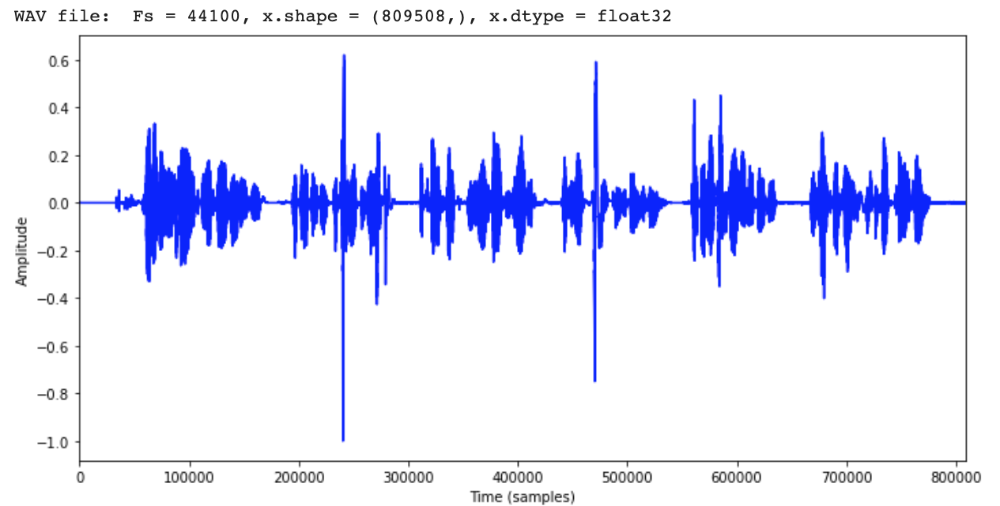
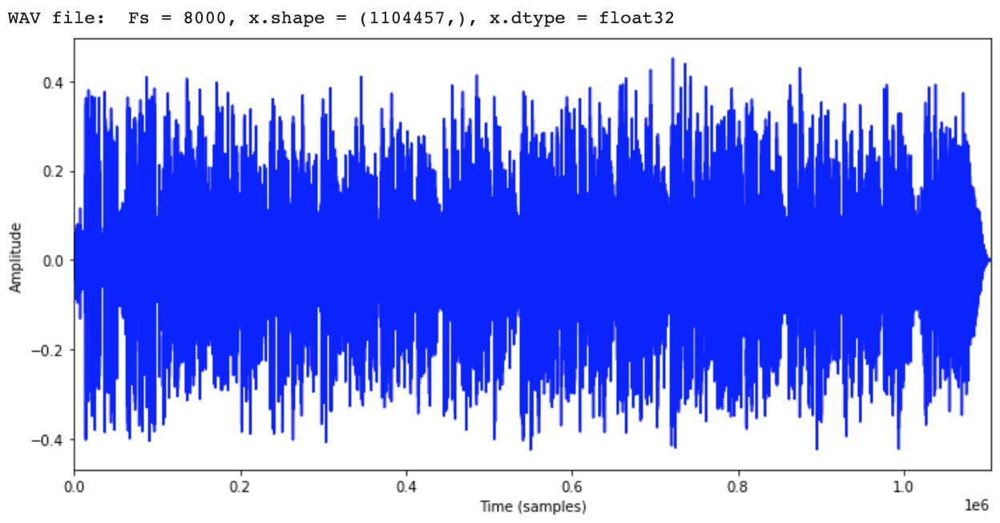
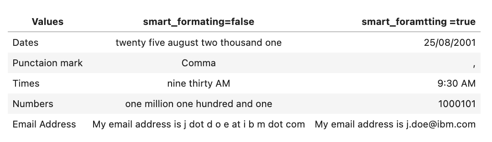
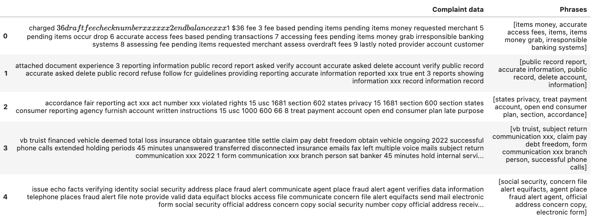
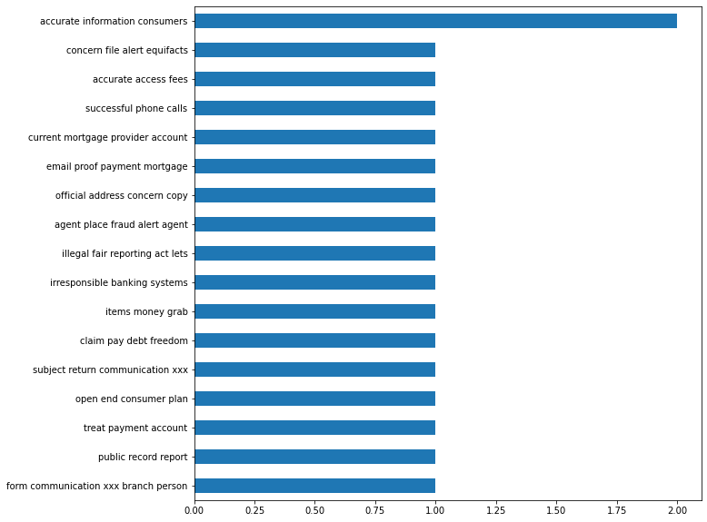

# Watson Speech to Text tutorial

#### Pre-requisites
Ensure that you have Speech to Text service installed on your cluster.

### 1. Connect to the Cluster via CLI
1. Log in to your IBM Cloud account.

`ibmcloud login`

2. Select the right account when prompted.

3. Set the correct resource group using the command

`ibmcloud login -g RESOUCE_GROUP`

4. Set the Kubernetes context to your cluster for this terminal session. For more information about this command, [see the docs](https://cloud.ibm.com/docs/containers?topic=containers-cli-plugin-kubernetes-service-cli#cs_cluster_config).

`ibmcloud ks cluster config --cluster CLUSTER_ID`

5. Verify that you can connect to your cluster.

`kubectl config current-context`

6. Create a local proxy to the cluster with kubectl proxy in a separate terminal

`kubectl proxy`

7. Expose the STT service endpoint using kubectl port forword 
 `kubectl port-forward svc/install-1-stt-runtime 1080`

 Now you can use the STT service into pyhton notebook using http://localhost:1080/

8. Set the NAMESPACE and INSTALL_NAME environment variables.

### 2. Watson Speech To Text Analysis

#### Step 1. Data Loading and Setting up the service
Watson Speech to Text offers so-called parameters for various Speech To text recognization, audio pre-processing, noise removal, number of speakers in the convesation etc.

1. Import and initialize some helper libs that are used throughout the tutorial.

```
from matplotlib import pyplot as plt
import IPython.display as ipd
import librosa
import pandas as pd
%matplotlib inline
import soundfile as sf
```

2. Load the voice data 

`file_name = './Sample_dataset/harvard.wav'`

3. Create a custom function to plot amplitude frequency.

```
def print_plot_play(fileName, text=''):
    x, Fs = librosa.load(fileName, sr=None)
    print('%s Fs = %d, x.shape = %s, x.dtype = %s' % (text, Fs, x.shape, x.dtype))
    plt.figure(figsize=(10, 5))
    plt.plot(x, color='blue')
    plt.xlim([0, x.shape[0]])
    plt.xlabel('Time (samples)')
    plt.ylabel('Amplitude')
    plt.tight_layout()
    plt.show()
    ipd.display(ipd.Audio(data=x, rate=Fs))
```





4. Setup the parameters for using Speech to Text service

```
# Setting up the headers for post request to service 
headers = {"Content-Type": "audio/wav"}
# Setting up params
params ={'model':'en-US_Multimedia'}
speech_to_text_url ='http://localhost:1080/speech-to-text/api/v1/recognize?'
```

5. Create a function to get the values from the Speech to Text service

```
def getTextFromSpeech(headers,params,file_name):
    r = requests.post(speech_to_text_url,headers=headers,params =params,data=open(file_name, 'rb'))
    return r.text
```

### Step 2. Speech data processing

#### 2.A. Background Audio suppression

1. Load the speech data and print the amplitude frequency

```
back_audio ='./Sample_dataset/samples_audio-files_11-ibm-culture-2min.wav'
print_plot_play(back_audio, text='WAV file: ')
```



2. Create a custom function to get the transcribed result without processing.

```
def show_result(result):
    json_obj = json.loads(result)
    results_data = json_obj['results']
    for result1 in results_data:
        for transcript in result1['alternatives']:
            print("Transcript ---  ", transcript['transcript'])
```

3. Remove Background noise form data using background_audio_suppression parameter with url

```
params ={'model':'en-US_Telephony',"background_audio_suppression":"0.5"}
result = getTextFromSpeech(headers,params,back_audio)
show_result(result)
```

#### 2.B. Speech Audio Parsing

1. Use the end of phrase silence time for speech audio parsing.

```
params ={'model':'en-US_Multimedia',"end_of_phrase_silence_time":"0.2"}
result = getTextFromSpeech(headers,params,file_name)
```

#### 2.C Speaker Labels

1. Set the `speaker_labels` to find the number of speakers in the speech data

```
params ={'model':'en-US_Telephony',"speaker_labels":"true"}
speaker_audio = './Sample_dataset/samples_audio-files_07-ibm-earnings-2min.wav'
result_speaker = getTextFromSpeech(headers,params,speaker_audio)
```

2. Visualize the output

IMAGE

3. Create a custom function to find the number of speakers in the speech data

```
def get_speaker_data(result_speaker):
    json_obj = json.loads(result_speaker)
    results_data = json_obj['results']
    speaker_data =json_obj['speaker_labels']
    speaker_dict =[]
    # Detect how many speaker in chat 
    i=0
    for speaker in speaker_data:
        if i ==0:
            temp_speaker = speaker['speaker']
            start_time = speaker['from']
            end_time = speaker['to']
            i=i+1
        elif temp_speaker == speaker ['speaker']:
            end_time = speaker['to']
            i=i+1
        elif temp_speaker != speaker ['speaker']:
            speaker_dict.append({'Speaker':temp_speaker, 'start_time':start_time,'end_time':end_time})
            temp_speaker = speaker['speaker']
            start_time = speaker['from']
            end_time = speaker['to']
            i=i+1
    speaker_dict.append({'Speaker':temp_speaker, 'start_time':start_time,'end_time':end_time})
    for result1 in results_data:
        data =result1['alternatives']
        for time in data:
            i =0
            for t in time['timestamps']:
                if i==0:
                    start_time = t[1]
                elif i == len(time['timestamps'])-1:
                    end_time = t[2]
                i=i+1 
            for speaker in speaker_dict:
                 if speaker['end_time'] > end_time:
                        print("Speaker ",speaker['Speaker'],"  ",time['transcript'])
                        break   
```

#### 2.D Response formatting and filtering

Speech to Text service provides features that you can use to parse transcription results. You can format a final transcript to include more conventional representations of certain strings and to include punctuation. You can redact sensitive numeric information from a final transcript.

1. Use smart_formatting parameter to get conventional results:

```
params ={'model':'en-US_Telephony',"smart_formatting":"true","background_audio_suppression":"0.5"}
result = getTextFromSpeech(headers,params,back_audio)
```




### Step 3. Microphone Recognition

To record real time voice open source python lib SpeechRecognition & PyAudio v0.2.12 will be used

1. Install the open source libraries :

    a. pip install SpeechRecognition
    b. brew install portaudio
    c. pip install pyaudio

2. Record audio using mircrophon

```
r = sr.Recognizer()
with sr.Microphone() as source:
    print("Say something!")
    audio1 = r.listen(source)
```

3. Use the Watson Speech to Text service to transcribe the recorded audio

```
 wav_data = audio1.get_wav_data(
            convert_rate=None if audio1.sample_rate >= 8000 else 8000,  # audio samples must be at least 8 kHz
            convert_width=2  # audio samples should be 16-bit
        )
ipd.display(ipd.Audio(wav_data))    

r = requests.post(speech_to_text_url,headers=headers,params =params,data=wav_data)
```

### Step 4. Transcribe customer call and extract meaningful insights using Watson NLP library

Speech To text service can be used to transcribe calls from the customer care centers. These transcripts can then be leveraged to extract insights using the `watson_nlp` library.

1. Load customer care call data. The data is available in the same [GitHub Repo](https://github.com/ibm-build-labs/Watson-Speech).

```
path = "./conusmer_speech_data"
call_center_list = os.listdir(path)
print(call_center_list)
```

2. Create a function to combine the transcripts into one document
```
def get_result(result):
    output =""
    json_obj = json.loads(result)
    results_data = json_obj['results']
    for result1 in results_data:
        for transcript in result1['alternatives']:
            output = output+" "+transcript['transcript']
    return output
```

3. Process all call-center voice data and create a list of documents
```
call_center_text_list=[]
for file_name in call_center_list:
    result = getTextFromSpeech(headers,params,path+"/"+file_name)
    call_center_text_list.append(get_result(result))
```

4. Load relevant models from the Watson NLP library
```
import watson_nlp
noun_phrases_model = watson_nlp.load(watson_nlp.download('noun-phrases_rbr_en_stock'))
keywords_model = watson_nlp.load(watson_nlp.download('keywords_text-rank_en_stock'))
syntax_model = watson_nlp.load(watson_nlp.download('syntax_izumo_en_stock'))
```

5. Extend the stop words list to filter out the common stop words from analysis
```
stop_words = list(wnlp_stop_words)
stop_words.extend(["gimme", "lemme", "cause", "'cuz", "imma", "gonna", "wanna", 
                   "gotta", "hafta", "woulda", "coulda", "shoulda", "howdy","day"])
```

6. Remove stop words and lowercase the text in the transcripts
```
# Pre-processing steps for document level only remove stop words  & Patterns which is find they are comman
def clean(doc):
    stop_free = " ".join([word.replace('X','').replace('/','') for word in doc.split() if word.lower() not in stop_words])
    return stop_free
```

7. Extract keywords and phrases from the transcribed document.
```
def extract_keywords(text):
    # Run the Syntax and Noun Phrases models
    syntax_prediction = syntax_model.run(text, parsers=('token', 'lemma', 'part_of_speech'))
    noun_phrases = noun_phrases_model.run(text)
    # Run the keywords model
    keywords = keywords_model.run(syntax_prediction, noun_phrases, limit=5)  
    keywords_list =keywords.to_dict()['keywords']
    key_list=[]
    for i in range(len(keywords_list)):
        key_list.append(keywords_list[i]['text'])
    return {'Complaint data':text,'Phrases':key_list}
```



8. Removing uni-gram and bi-grams from the dataset and plot the most frequent phrases.




#### Conclusion:

This tutorial walks you through the steps of starting a Speech to Text service on the kube cluster, pre-processing the speech dataset and using the Speech to Text service to transcribe speech data. This tutorial also shows you how to extract meaningful insights from the data by combining the functionalities of Watson Speech to Text and Watson NLP library.