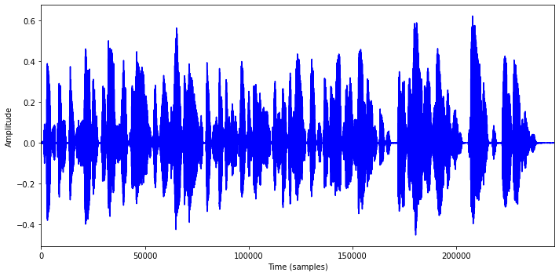
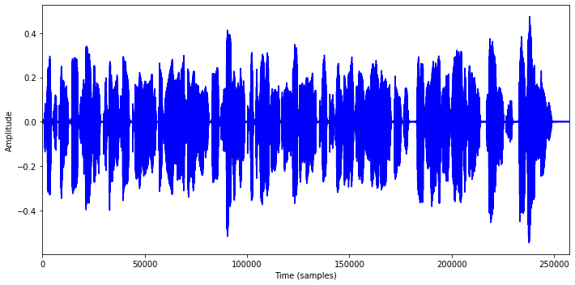
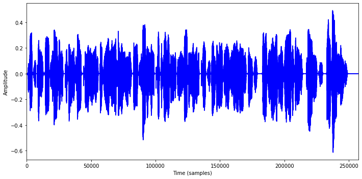

# Watson Text to Speech tutorial
### Use Case:
**Watson Text to Speech can be used to play back customer messages to:**
   1. Build a mobile to-do app that allows for users to capture voice memos to save as written Todo items.
   1. Use as a simple out of the box model to capture English voices without any customization.
   1. Use as a light weight feature that can be invoked from the constrained mobile device.


#### Pre-requisites
Ensure that you have Text to Speech (TTS) service installed on your cluster.

### 1. Connect to the Cluster via CLI
1. Log in to your IBM Cloud account.

`ibmcloud login`

2. Select the right account when prompted.

3. Set the correct resource group using the command

`ibmcloud login -g RESOUCE_GROUP`

4. Set the Kubernetes context to your cluster for this terminal session. For more information about this command, [see the docs](https://cloud.ibm.com/docs/containers?topic=containers-cli-plugin-kubernetes-service-cli#cs_cluster_config).

`ibmcloud ks cluster config --cluster CLUSTER_ID`

5. Verify that you can connect to your cluster.

`kubectl config current-context`

6. Create a local proxy to the cluster with kubectl proxy in a separate terminal

`kubectl proxy`

7. Expose the TTS service endpoint using kubectl port forword 

 `kubectl port-forward svc/install-1-tts-runtime 1080`

Now you can use the TTS service into pyhton notebook using http://localhost:1080/

8. Set the NAMESPACE and INSTALL_NAME environment variables.

### 2. Watson Text to Speech Analysis

#### Step 1. Data Loading and Pre-processing on Text
Watson Text to Speech offers so-called parameters for various text-to-speech synthesis for an entire request rate_percentage, pitch_percentage, and spell_out_mode.By using these parameters we can modify the output of audio. 

1. Import and initialize some helper libs that are used throughout the tutorial.

    ```
    from matplotlib import pyplot as plt
    import IPython.display as ipd
    import librosa
    import pandas as pd
    %matplotlib inline
    import soundfile as sf
    ```

2. Create a custom function to plot amplitude frequency.

    ```
    def print_plot_play(fileName, text=''):
        x, Fs = librosa.load(fileName, sr=None)
        print('%s Fs = %d, x.shape = %s, x.dtype = %s' % (text, Fs, x.shape, x.dtype))
        plt.figure(figsize=(10, 5))
        plt.plot(x, color='blue')
        plt.xlim([0, x.shape[0]])
        plt.xlabel('Time (samples)')
        plt.ylabel('Amplitude')
        plt.tight_layout()
        plt.show()
        ipd.display(ipd.Audio(data=x, rate=Fs))
    
    ```

3. Data loading (Text Data)

    ```
        consumer_df = pd.read_csv('consumer_data.csv')
    ```

4. Text Pre Processing :

Speech Synthesis services accepts the data in format of JSON. There are so many escape characters that have came into text which is not valid for JSON string .So replacing those char from the text.

    ```
      def clean(doc):
      stop_free = " ".join([word.replace('X','').replace('/','').replace("''",'').replace(',','').replace(':','').replace('{','').replace('}','').replace('"','') for word in doc.split()])
      return stop_free 

    ```

#### Step 2. Setting up the service
1. Setup the parameters for using Text to Speech service

    ```
    headers = {"Content-Type": "application/json","Accept":"audio/wav"}
    params ={'output':'output_text.wav'}
    text_to_speech_url ='http://localhost:1080/text-to-speech/api/v1/synthesize'
    ```

2. Use this example text in the subsequent steps to try out the TTS service.

    ```
    data ='{"text":"Text to Speech service provides APIs that use IBM\'s speech-synthesis capabilities to synthesize text into natural-sounding speech in a variety of languages, dialects, and voices"}'
    ```

3. Create a custom function to get speech from text using the TTS service.

    ```
    def getSpeechFromText(headers,params,data,file_name):
        request =requests.post(text_to_speech_url,headers=headers,params =params,data=data)
        print(request.status_code)
        with open(file_name, mode='bx') as f:
            f.write(request.content)
    ```

4. Send the example text to the TTS service and use the custom function to get the speech output.

    ```
    file_name = 'text_to_speech_sample1.wav'
    result = getSpeechFromText(headers,params,data,file_name)
    print_plot_play(file_name)
    ```



#### Step 3. Modifying speech synthesis characteristics :

Text to Speech service includes query parameters that you can use to globally modify the characteristics of speech synthesis for an entire request:

- rate_percentage
- pitch_percentage

1. Use the `rate_percentage` parameter to adjust the rate percentage and get the output from the TTS service.

```
params ={'voice':'en-US_AllisonV3Voice','rate_percentage':-5}
file_name ="text_to_speeh_rate.wav"
```



2. Use the `pitch_percentage` parameter to adjust the pitch percentage and get the output from the TTS service.

```
params ={'voice':'en-US_AllisonV3Voice','pitch_percentage':-10}
file_name ="text_to_speeh_pitch.wav"
```



#### Step 4 . Case Study : Play Back Customer Calls 
By using Text to speech services companies can create this box model to capture English voices without any customization. So here we are passing multiple texts into a speech synthesis service to save multiple files.
```
customer_call_dir = 'customer_call/'
params ={'voice':'en-US_AllisonV3Voice'}
i=0
for data in consumer_clean_list:
    if i < 5:
        file_name = customer_call_dir+"consumer_call"+str(i)+".wav"
        data1 = '{"text":"'+data+'"}'
        getSpeechFromText(headers,params,data1,file_name)
        i=i+1
        print("Saving consumer calls ---"+file_name)
```

#### Conclusion:

This tutorial walks you through the steps of starting a Text to Speech service on the kube cluster, processing the dataset and using the Text to Speech service. This tutorial also shows you how to modify speech synthesis characteristics using different parameters.