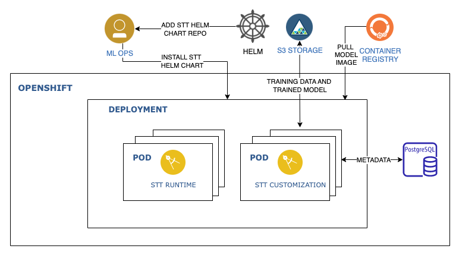

# Install IBM Watson Speech to Text Library in OpenShift

IBM Watson Speech to Text (STT) Library for Embed transcribes written text from spoken audio in a number of languages. The service leverages machine learning to combine knowledge of grammar, language structure, and the composition of audio and voice signals to accurately transcribe the human voice.

Note that the STT service can be deployed either with or without customization. A customizable deployment allows users to update the service to understand how to transcribe words. This tutorial walks you through the steps install a customizable STT service in OpenShift. We will use [this](https://github.com/IBM/ibm-watson-embed-charts/tree/main/charts/ibm-watson-stt-embed) helm chart to deploy the service.

## Architecture diagram



## Prerequisites

- Install [helm 3](https://helm.sh/docs/intro/install/).
- Ensure you have an [entitlement key](https://myibm.ibm.com/products-services/containerlibrary). You may need to create one. This key is required to access [images](https://www.ibm.com/docs/en/watson-libraries?topic=i-accessing-files) used in this tutorial.
- Set an environment variable:
  ```sh
  export IBM_ENTITLEMENT_KEY=<Set the entitlement key>
  ``` 
- For customization:
  - S3 Compatible Storage 
  - PostgreSQL Database
- OpenShift Cluster on which you will deploy the service.

## S3 Compatible Storage

For customization, an S3 compatible storage service must exist that supports HMAC (access key and secret key) credentials. Watson Speech requires one bucket that it can read and write objects to. The bucket will be populated with stock models at install time and will also store customization artifacts, including training data and trained models.

Here are the steps to obtain IBM Cloud S3 bucket HMAC credentials and endpoint. You may choose bucket based on the cloud providers. 

1. Log in to [IBM Cloud](https://cloud.ibm.com/login).
2. From the IBM Cloud Dashboard, click the Cloud Object Storage service instance that you want to work with.
3. To get the Bucket name, click `Buckets` in the left pane and select your preferred bucket name and make a note.
4. To get the endpoint URLs, click `Endpoint` in the left pane and select your preferred location or region.
   1. Copy your preferred public `endpoint` (for example, s3.us-east.cloud-object-storage.appdomain.cloud) and use it as the value for the `Endpoint URL` field (or `endpointUrl` parameter).
   2. Copy your preferred location or `region` (for example, us-east) and use it as the value for the Region field (or region parameter).
5. To view the service credentials, click Service credentials in the left pane, and then click View credentials. (If you want to define new credentials, click New credential, click Advanced options, then select Include HMAC Credential.)
6. Copy the `cos_hmac_keys/secret_access_key` value and use it as the value for the `Secret access key` field (or `secretAccessKey parameter`).
7. Copy the `cos_hmac_keys/access_key_id` value and use it as the value for the `Access key ID` field (or `accessKeyId parameter`).

Set all S3 crededentials and information in environment variable so that we can make use them during stt library installation. Please modify the below script based on the information you collected from the previous steps.

```sh
export S3_BUCKET_NAME=<Bucket name you found in step 3 >
export S3_REGION=<Region can be found in step 4.1 when you select your bucket>
export S3_ENPOINT_URL=<Endpoint URL you found in step 4>
export S3_SECRET_KEY=<secretAccessKey you found in step 6>
export S3_ACCESS_KEY=<accessKeyId you found in step 7>
```

example Connecting by using HMAC authentication and example S3 bucket values. Please don't use the value provided. They will not work.

```sh
export S3_BUCKET_NAME=speech-embed
export S3_REGION=us-east
export S3_ENPOINT_URL=https://s3.us-east.cloud-object-storage.appdomain.cloud
export S3_SECRET_KEY=12a3bcd4567890ef123g4567890hij12k1m3n4567o8901p2
export S3_ACCESS_KEY=1a2dfbc3d45678901ef2g3h45678i90jkl
```

```yaml
  ibmcoss3:
    - name: Account 1
      credentials:
        secretAccessKey: 12a3bcd4567890ef123g4567890hij12k1m3n4567o8901p2
        accessKeyId: 1a2dfbc3d45678901ef2g3h45678i90jkl
        region: us-east
      endpoint:
        endpointUrl: s3.us.cloud-object-storage.appdomain.cloud
```

## Install Postgresql

PostgreSQL Database is required to manage metadata related to customization. The customization container uses TLS to Postgres, but always sets up the connection with a "NonValidatingFactory" which does not do cert validation. Here I am going to use a self signed certificate to enable TLS in Postgresql database. In this tutorial We are using bitnami Postgresql packaged in helm charts.

Create Certificate authority certificate `ca.crt` and key `ca.key`

```sh
openssl req \
  -x509 \
  -nodes \
  -newkey ec \
  -pkeyopt ec_paramgen_curve:prime256v1 \
  -pkeyopt ec_param_enc:named_curve \
  -sha384 \
  -keyout ca.key \
  -out ca.crt \
  -days 3650 \
  -subj "/CN=*"
```

Create certificate signing requrest `server.csr`

```sh
  openssl req \
  -new \
  -newkey ec \
  -nodes \
  -pkeyopt ec_paramgen_curve:prime256v1 \
  -pkeyopt ec_param_enc:named_curve \
  -sha384 \
  -keyout server.key \
  -out server.csr \
  -days 365 \
  -subj "/CN=postgresql-release-hl"
```

create `server.crt` certificate using `ca.crt` and `ca.key` from `server.csr`

```sh
  openssl x509 \
  -req \
  -in server.csr \
  -days 365 \
  -CA ca.crt \
  -CAkey ca.key \
  -CAcreateserial \
  -sha384 \
  -out server.crt
```

Create a tls secret for the certifiate you created

```sh
oc create secret tls pg-tls-secret \
--cert=server.crt \
--key=server.key
```

Add bitnami helm chart repo

```sh
helm repo add bitnami https://charts.bitnami.com/bitnami
```

Install Postgresql helm chart

```sh
helm install postgresql-release bitnami/postgresql \
--set tls.enabled="true" \
--set tls.certificatesSecret="pg-tls-secret" \
--set tls.certFilename="tls.crt" \
--set tls.certKeyFilename="tls.key"
```

In OpenShift cluster Statefulset pod might not spin up because, it needs a extra previllege to run the container. You may see events like below
` create Pod postgresql-release-0 in StatefulSet postgresql-release failed error: pods "postgresql-release-0" is forbidden: unable to validate against any security context constraint: [provider "anyuid": Forbidden: not usable by user or serviceaccount, provider restricted:` To solve this issue please follow the below instruction.

create service account and assign `anyuid` SCC

```sh
oc create serviceaccount db-sa
oc adm policy add-scc-to-user anyuid -z db-sa
```

Set the service account to statefulset `postgresql-release`

```sh
oc set serviceaccount statefulset postgresql-release db-sa
```

Set the Postgresql password in an environment variable for next step to use.

```sh
export POSTGRES_PASSWORD=$(oc get secret postgresql-release -o jsonpath="{.data.postgres-password}" | base64 -d)
```
## Install Speech to Text Library embed helm chart

Let start with cloning the helm chart github repo

```sh
git clone https://github.com/IBM/ibm-watson-embed-charts.git
cd ibm-watson-embed-charts/charts
```

The containers deployed in this chart come from the IBM entitled registry. You must create a Secret with credentials to pull from the IBM entitled registry. ibm-entitlement-key is the default name, but this can be changed by updating the imagePullSecrets value.

An example command to create the pull secret:

```sh
 oc create secret docker-registry ibm-entitlement-key \
  --docker-server=cp.icr.io \
  --docker-username=cp \
  --docker-password=$IBM_ENTITLEMENT_KEY \
  --docker-email=<your-email>
```

> By default, the models that are enabled are `en-US_Multimedia` and `en-US_Telephony` with defaultModel set to `en-US_Multimedia`.

Helm charts have configurable values that can be set at install time. To configure the install further, such as enabling additional models, Refer to the base `values.yaml` for documentation and defaults for the values. Values can be changed using `--set` or using YAML files specified with `-f/--values`. Here we are setting values using `--set` parameter

```sh
helm install stt-release ./ibm-watson-stt-embed \
--set license=true \
--set nameOverride=stt \
--set models.enUSTelephony.enabled=false \
--set postgres.host="postgresql-release-hl" \
--set postgres.user="postgres" \
--set postgres.password=${POSTGRES_PASSWORD} \
--set objectStorage.endpoint=${S3_ENPOINT_URL} \
--set objectStorage.region=${S3_REGION} \
--set objectStorage.bucket=${S3_BUCKET_NAME} \
--set objectStorage.accessKey=${S3_ACCESS_KEY} \
--set objectStorage.secretKey=${S3_SECRET_KEY}
```

## Verifying the chart

See the instruction (from NOTES.txt within chart) after the helm installation completes for chart verification. The instruction can also be viewed by running:

```sh
helm status stt-release
```

For basic usage of customization, see the customizing Watson Speech Library for Embed [documentation](https://www.ibm.com/docs/en/watson-libraries?topic=containers-customization-example).

The complete API reference for Watson Speech-to-Text can be found [here](https://cloud.ibm.com/apidocs/speech-to-text).


## Use the service

In one terminal, create a proxy through the service:

```sh
oc proxy
```

Download an example audio file as example.flac:

```sh
curl --url https://github.com/watson-developer-cloud/doc-tutorial-downloads/raw/master/speech-to-text/0001.flac \
      -sLo example.flac
```

Send a /recognize request using the downloaded file:

```sh
curl --url "http://localhost:8001/api/v1/namespaces/stt-demo/services/https:stt-release-runtime:https/proxy/speech-to-text/api/v1/recognize?model=en-US_Multimedia" \
      --header "Content-Type: audio/flac" \
      --data-binary @example.flac
```
