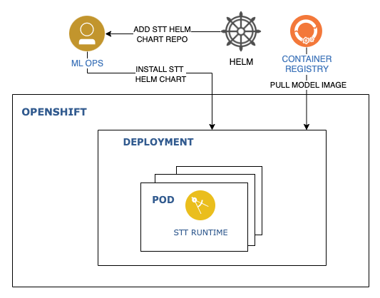

# Deploy Customizable STT on OpenShift

IBM Watson Speech to Text (STT) Library for Embed transcribes written text from spoken audio in a number of languages. The service leverages machine learning to combine knowledge of grammar, language structure, and the composition of audio and voice signals to accurately transcribe the human voice.

The STT service can be deployed either with or without customization. A customizable deployment allows users to update the service to understand how to transcribe words. While a non-customizable deployment requires only a single container image and can easily be deployed with a container runtime like Docker or Podman, a customizable deployment requires multiple images and a PostgreSQL database. It is recommended to use the Helm chart to install on an OpenShift cluster.

This tutorial walks you through the steps install a **STT runtime** in OpenShift. We will use [this](https://github.com/IBM/ibm-watson-embed-charts/tree/main/charts/ibm-watson-stt-embed-runtime) helm chart to deploy the runtime service.

## Reference Architecture



## Prerequisites

- Install [Helm 3](https://helm.sh/docs/intro/install/).
- Ensure you have an [entitlement key](https://myibm.ibm.com/products-services/containerlibrary). You may need to create one. This key is required to access [images](https://www.ibm.com/docs/en/watson-libraries?topic=i-accessing-files) used in this tutorial.
- Set an environment variable.

  ```sh
  export IBM_ENTITLEMENT_KEY=<Set the entitlement key>
  ```
- An OpenShift Cluster on which you will deploy the service.

## Install Speech to Text Helm Chart

Clone the Helm chart Github repository.

```sh
git clone https://github.com/IBM/ibm-watson-embed-charts.git
cd ibm-watson-embed-charts/charts
```

The containers deployed by this chart come from the IBM Entitled Registry. You must create a Secret with credentials to pull from this registry. The default name is `ibm-entitlement-key`, but this can be changed by updating the value of `imagePullSecrets`.

An example command to create the pull secret:

```sh
 oc create secret docker-registry ibm-entitlement-key \
  --docker-server=cp.icr.io \
  --docker-username=cp \
  --docker-password=$IBM_ENTITLEMENT_KEY \
  --docker-email=<your-email>
```

By default, the models that are enabled are `en-US_Multimedia` and `en-US_Telephony` with defaultModel set to `en-US_Multimedia`.

Helm charts have configurable values that can be set at install time. To configure, e.g. enable additional models, refer to the base `values.yaml`. Values can be changed using `--set` or using YAML files specified with `-f/--values`. Below we set values using `--set` parameter.

```sh
helm install stt-release ./ibm-watson-stt-embed-runtime \
--set license=true \
--set nameOverride=stt \
--set models.enUSTelephony.enabled=false
```

## Verify the Chart

See the instruction (from NOTES.txt within chart) after the Helm installation completes for chart verification. The instruction can also be viewed by running the following command.

```sh
helm status stt-release
```

The complete API reference for Watson Speech to Text can be found [here](https://cloud.ibm.com/apidocs/speech-to-text).

## Test the Service

In one terminal, create a proxy through the service.

```sh
oc proxy
```

Download an example audio file as `example.flac`:

```sh
curl --url https://github.com/watson-developer-cloud/doc-tutorial-downloads/raw/master/speech-to-text/0001.flac \
      -sLo example.flac
```

Send a `recognize` request using the downloaded file:

```sh
curl --url "http://localhost:8001/api/v1/namespaces/stt-demo/services/https:stt-release-runtime:https/proxy/speech-to-text/api/v1/recognize?model=en-US_Multimedia" \
      --header "Content-Type: audio/flac" \
      --data-binary @example.flac
```